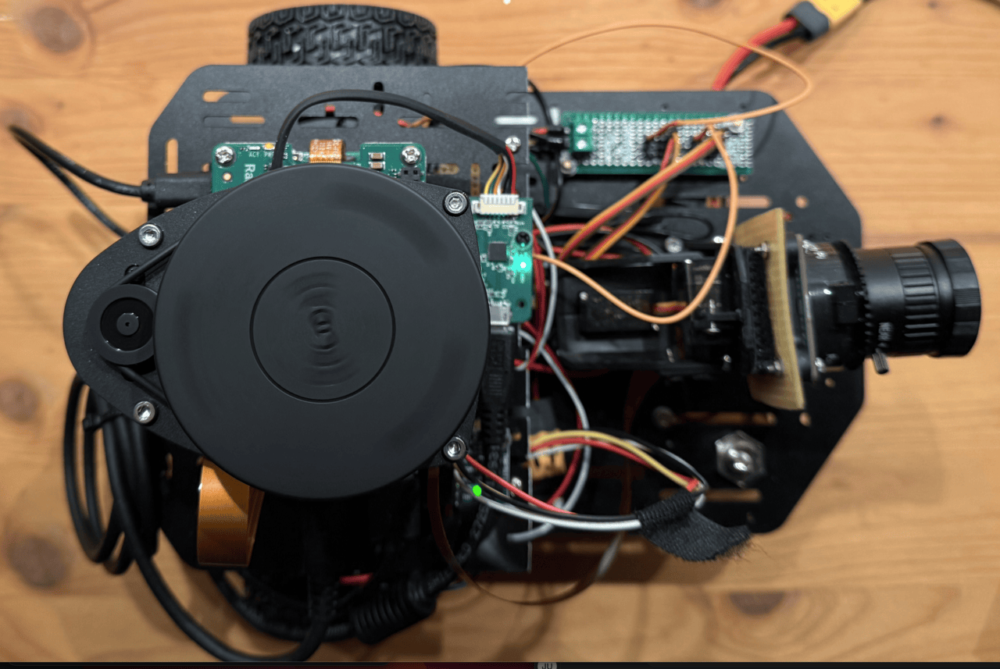

# AMR — Autonomes Fahrzeug im Kleinformat

[](https://github.com/unger-robotics/amr-projekt/releases/latest)
[](https://unger-robotics.github.io/amr-projekt/)
[](amr/LICENSE)
[](https://docs.ros.org/en/humble/)
[](https://www.raspberrypi.com/products/raspberry-pi-5/)

Projektarbeit nach VDI 2206: Ein Autonomer Mobiler Roboter (AMR / Autonomous Mobile Robot) mit Differentialantrieb als skaliertes Modell eines autonomen Fahrzeugs (Kfz). Zwei ESP32-S3 Mikrocontroller steuern unter FreeRTOS die Echtzeit-Regelung und kommunizieren via micro-ROS mit einem Raspberry Pi 5, der ROS 2 Humble fuer Navigation, SLAM und Sensorfusion ausfuehrt. Die Dreischicht-Architektur bildet die Subsysteme eines modernen Kfz nach — vom Motorsteuergeraet ueber Sensorfusion bis zur ADAS-Objekterkennung.



## Kfz-Analogie

Das AMR operiert in einer strukturierten Indoor-Umgebung, vergleichbar mit einem Level-4-Fahrzeug in einem abgesperrten Betriebsgelaende (Operational Design Domain, ODD). Die Dreischicht-Architektur bildet die Steuergeraete-Topologie eines modernen Kfz ab: Fahrkern (Antriebsstrang), Bedien- und Leitstandsebene (Kombiinstrument) und intelligente Interaktion (ADAS). Jede Anforderung benennt eine Funktion, einen messbaren Schwellwert und einen Nachweis — wie ein Kfz-Sicherheitsziel mit Fehlertoleranzzeit und Pruefvorschrift nach ISO 26262.

## Systemarchitektur

```
Ebene C – Intelligente Interaktion              Kfz: ADAS Level 3+ / HMI
  Hailo-8L Vision (34 ms Inferenz)               → ADAS-Frontkamera + Edge-KI
  Gemini Cloud-Semantik                           → Cloud-basierte Routenoptimierung
  Sprachschnittstelle (VAD → faster-whisper STT)   → Sprachsteuerung (offline, HMI)
  ArUco-Docking (0,73 cm Versatz)                 → Automatisches Einparken (APA)

Ebene B – Bedien- und Leitstandsebene           Kfz: Kombiinstrument + Infotainment
  Dashboard (React/Vite/TypeScript)               → Head-Up-Display / Zentraldisplay
  WebSocket/MJPEG Telemetrie                      → Kameramonitoring (Rueckfahrkamera)
  Joystick-Fernsteuerung (0,40 m/s)              → Manueller Fahrmodus (SAE Level 0)

Ebene A – Fahrkern                               Kfz: Antriebsstrang + Fahrwerk + Bremse
  Pi 5: Nav2, SLAM, EKF Sensorfusion             → ADAS-Zentralrechner
  Drive-Knoten (ESP32-S3, Core 1: PID 50 Hz)     → Motorsteuergeraet (ECM)
  Sensor-Knoten (ESP32-S3, IMU/Cliff/Batterie)   → Sensorsteuergeraet (ESC/ABS-ECU)
  Cliff-Safety + CAN-Direktpfad (2,0 ms)         → Notbremssystem (AEB)
```

```
                        ┌─────────────────────────────────────────────────┐
                        │       Raspberry Pi 5 — ADAS-Zentralrechner     │
                        │   ROS 2 Humble · Nav2 · SLAM Toolbox · EKF    │
                        │   micro-ROS Agents · Dashboard Bridge          │
                        │   Vision · Audio · CAN Bridge                  │
                        └────────┬──────────────────┬────────────────────┘
                     UART 921600 │                  │ UART 921600
                   /dev/amr_drive│                  │/dev/amr_sensor
                        ┌────────┴────────┐  ┌─────┴──────────────┐
                        │  Drive-Knoten   │  │  Sensor-Knoten     │
                        │  ESP32-S3       │  │  ESP32-S3          │
                        │  (ECM)          │  │  (ESC/ABS-ECU)     │
                        │                 │  │                    │
                        │  PID 50 Hz      │  │  IMU (MPU6050)     │
                        │  Odometrie      │  │  Batterie (INA260) │
                        │  LED-Steuerung  │  │  Ultraschall (PDC) │
                        │                 │  │  Cliff (AEB)       │
                        │                 │  │  Servo (PCA9685)   │
                        └────────┬────────┘  └─────┬──────────────┘
                                 │  CAN-Bus 1 Mbit/s (redundant)  │
                                 └────────────────────────────────┘
```

## Dual-Path-Redundanz (Kfz: Redundante Bussysteme)

Zwei unabhaengige Kommunikationspfade verbinden die MCUs mit dem Pi 5 — vergleichbar mit der Trennung von CAN und FlexRay im Kfz:

```
Prioritaet 1: micro-ROS / UART 921600 Baud (< 500 ms Timeout)
  cliff_safety_node prueft Cliff + Ultraschall → volle Sicherheitslogik

Prioritaet 2: CAN 0x100 (Fallback, nur wenn UART > 500 ms ausfaellt)
  can_watchdog (systemd, Host) → eingeschraenkte Sicherheit, nur MCU-Cliff

Prioritaet 3: Failsafe (beide Pfade ausgefallen)
  Firmware-Logik: tv=0, tw=0 → Motorenstopp
```

Die Firmware auf Core 1 entscheidet autonom: `if (ros_alive) → micro-ROS` / `else if (can_alive) → CAN` / `else → Stopp`. Der Pi 5 ist fuer den Notstopp nicht erforderlich.

## Dual-Core-Architektur (Kfz: ECU-Partitionierung)

Beide ESP32-S3 nutzen FreeRTOS mit strikter Core-Trennung:

```
Drive-Knoten (ECM)                    Sensor-Knoten (ESC)
───────────────────                   ─────────────────────
Core 0 — Kommunikation               Core 0 — Kommunikation
  micro-ROS spin_some (~500 Hz)         micro-ROS spin_some (~500 Hz)
  Sub: /cmd_vel, /hardware_cmd          Sub: /servo_cmd, /hardware_cmd
  Pub: /odom (20 Hz)                       Pub: /cliff /range /imu /battery (82 Msg/s)
  LED State Machine                     PCA9685 I2C Write (Deferred Pattern)

Core 1 — Echtzeit                     Core 1 — Echtzeit
  PID-Regelung 50 Hz (20 ms)           MPU6050 I2C Read (50 Hz)
  Encoder-Quadratur (ISR)              Cliff GPIO-Poll (20 Hz)
  CAN RX: 0x120, 0x141          HC-SR04 Trigger/Read (10 Hz)
  Failsafe + Watchdog                   INA260 I2C Read (2 Hz)
                                        CAN TX: 0x110–0x1F0

Synchronisation: SharedData-Mutex     Synchronisation: SharedData + i2c_mutex
```

## Hardware

| Komponente       | Typ                     | Kfz-Pendant                    |
|------------------|-------------------------|--------------------------------|
| Recheneinheit    | Raspberry Pi 5, 8 GB    | ADAS-Zentralrechner            |
| MCU Drive        | XIAO ESP32-S3           | Motorsteuergeraet (ECM)        |
| MCU Sensor       | XIAO ESP32-S3           | Sensorsteuergeraet (ESC)       |
| Motoren          | JGA25-370 (1:34)        | Elektroantrieb + Drehzahlgeber |
| Motortreiber     | Cytron MDD3A            | Leistungselektronik (Inverter) |
| LiDAR            | RPLIDAR A1 (12 m)       | Lidar-Umfeldmodell             |
| IMU              | MPU6050 (30–35 Hz)      | Beschleunigungssensor ESP      |
| Batterie         | Samsung 3S 10,8 V       | HV-Batterie (skaliert)         |
| Batteriemonitor  | INA260                  | BMS (Batterie-Management)      |
| KI-Beschleuniger | Hailo-8L (13 TOPS)      | Edge-KI-Chip (Mobileye)        |
| Kamera           | IMX296 Global Shutter   | ADAS-Frontkamera               |
| Servos           | MG996R via PCA9685      | Lenkstellmotor                 |
| Audio            | MAX98357A + Lautsprecher | Lautsprecher (HMI)            |
| Mikrofon         | ReSpeaker Mic Array v2.0 | Mikrofon (Sprachsteuerung)    |
| CAN-Bus          | MCP2515, SN65HVD230     | Kfz-CAN-Bus (ISO 11898)       |

Raddurchmesser: 65,67 mm · Spurbreite: 178,0 mm · PID: Kp=0,4 Ki=0,1 Kd=0,0

## Validierungsergebnisse (Kfz: Pruefstandergebnisse)

| Messung                 | Ergebnis                     | Kfz-Pendant              | Status |
|-------------------------|------------------------------|--------------------------|--------|
| PID-Regelfrequenz       | 50 Hz, Jitter < 2 ms        | ECU-Zykluszeit           | PASS   |
| Geradeausfahrt mit IMU  | 2,1 cm Drift, 0,06° Heading | Spurhaltung (LKA)        | PASS   |
| Rotation 360°           | 1,88° Fehler                 | Lenkwinkelkalibrierung   | PASS   |
| Cliff-Latenz E2E        | 2,0 ms                       | AEB-Ansprechzeit         | PASS   |
| Cliff-Bremsweg          | 1,0 cm                       | Bremsweg bei v_max       | PASS   |
| LiDAR-Scanrate          | 7,7 Hz                       | Lidar-Scanrate           | PASS   |
| Datenverlust micro-ROS  | < 0,1 %                      | CAN-Frameverlust         | PASS   |
| Hailo-8L Inferenz       | 34 ms                        | ADAS-Latenz              | PASS   |
| ArUco-Docking           | 100 %, 0,73 cm Versatz       | Einparkquote (APA)       | PASS   |
| Pfadfolgefehler (ATE)   | MAE 0,16 m / RMSE 0,19 m (T3.1) | Fahrdynamik-Pruefstand   | PASS   |
| CAN-Bus (Dual-Path)     | 5604 Frames/30 s, 11/12 IDs  | Redundanter CAN-Bus      | PASS   |

## Architekturvergleich AMR vs. Kfz

| Architekturprinzip           | AMR (Option C)                        | Kfz (SAE L3+)                          |
|------------------------------|---------------------------------------|----------------------------------------|
| Redundante Kommunikation     | UART (micro-ROS) + CAN (Watchdog)     | CAN + CAN FD + Ethernet + FlexRay     |
| Gestaffelte Sicherheit       | 7 Ebenen, CAN-Notstopp ohne Pi 5     | ASIL A–D (ISO 26262), Safety-MCU      |
| Compute-Schichttrennung      | MCU (Echtzeit) + Pi 5 (KI/Nav)       | Zone-ECU + Central Compute + GPU/NPU  |
| Deterministische Regelung    | FreeRTOS Dual-Core, 50 Hz PID        | AUTOSAR Classic (OSEK/VDX), 1–10 ms   |

**Systematische Luecken zum Kfz:** Kein ASIL-Nachweis (ISO 26262), kein Fail-operational (nur Fail-safe), keine Multisensor-Fusion (Radar+Kamera), kein AUTOSAR-konformes BSW, keine HW-Diversitaet (2x gleiche MCU), keine V2X-Kommunikation.

## Schnellstart

### Voraussetzungen

- Raspberry Pi 5 (Debian Trixie) mit Docker und docker-compose
- PlatformIO CLI (MCU-Firmware)
- Node.js 20+ (Dashboard)
- mkcert (HTTPS-Zertifikate fuer Dashboard)

### 1. MCU-Firmware flashen

```bash
# Drive-Knoten (Kfz: Motorsteuergeraet)
cd amr/mcu_firmware/drive_node
pio run -e drive_node -t upload -t monitor

# Sensor-Knoten (Kfz: Sensorsteuergeraet)
cd amr/mcu_firmware/sensor_node
pio run -e sensor_node -t upload -t monitor
```

> **Wichtig:** Immer `-e <environment>` angeben! Ohne `-e` werden alle Environments geflasht.
> Erster Build: ~15 Min (micro-ROS aus Source). Folgebuilds gecached.

### 2. ROS 2-Container starten

```bash
cd amr/docker/
sudo bash host_setup.sh          # Einmalig: udev, Gruppen, Kamera
docker compose build              # Image bauen (~15-20 Min)
./run.sh colcon build --packages-select my_bot --symlink-install
./run.sh ros2 launch my_bot full_stack.launch.py
```

### 3. Dashboard starten

```bash
# Terminal 1: ROS 2 mit Dashboard-Bridge
./run.sh ros2 launch my_bot full_stack.launch.py use_dashboard:=True use_rviz:=False

# Terminal 2: Vite Dev-Server
cd dashboard/
npm install && npm run dev -- --host 0.0.0.0   # https://amr.local:5173
```

### 4. System verifizieren

```bash
cd amr/docker/
./verify.sh
```

## Launch-Argumente

```bash
./run.sh ros2 launch my_bot full_stack.launch.py [use_<name>:=True/False]
```

| Argument           | Default | Kfz-Pendant                  |
|--------------------|---------|------------------------------|
| `use_slam`         | True    | HD-Karte (Kartierung)        |
| `use_nav`          | True    | Routenplanung (Navigation)   |
| `use_rviz`         | False   | Diagnose-Display             |
| `use_sensors`      | True    | Sensorsteuergeraet           |
| `use_cliff_safety` | True    | Notbremssystem (AEB)         |
| `use_camera`       | False   | Frontkamera                  |
| `use_dashboard`    | False   | Kombiinstrument              |
| `use_vision`       | False   | ADAS-Objekterkennung         |
| `use_audio`        | False   | Audio-Feedback (HMI)         |
| `use_can`          | False   | Redundanter CAN-Bus          |
| `use_tts`          | False   | Sprachausgabe (TTS)          |
| `use_respeaker`    | False   | Richtungsmikrofon (DoA)      |
| `use_voice`        | False   | Sprachsteuerung (STT)        |

## Projektstruktur

```
amr-projekt/
├── amr/                            Fahrkern (Kfz: Antriebsstrang + ECUs)
│   ├── mcu_firmware/
│   │   ├── drive_node/             ECM: Antrieb, PID, Odometrie, LED
│   │   └── sensor_node/            ESC: IMU, Batterie, Cliff, Servo
│   ├── pi5/ros2_ws/src/my_bot/     ADAS-Zentralrechner (Launch, Config)
│   ├── docker/                     Dockerfile, run.sh, verify.sh
│   └── scripts/                    Validierung, Runtime-Knoten
├── dashboard/                      Kombiinstrument (React/Vite/TypeScript)
├── docs/                           Architektur- und Validierungsdoku
├── hardware/                       Spezifikationen, Schaltplaene, Datenblaetter
├── projektarbeit/                  Projektarbeit (Markdown + LaTeX)
├── planung/                        Roadmap, Testanleitungen, Messprotokolle
├── scripts/                        Wartung und Sync-Skripte
└── sources/                        Literatur-Kernaussagen
```

Detaillierte Entwicklerdokumentation in `CLAUDE.md` (Root), `amr/CLAUDE.md`, `amr/mcu_firmware/CLAUDE.md` und `dashboard/CLAUDE.md`.

## Linting und Code-Qualitaet

```bash
# Python
ruff check amr/                    # Lint (Zeilenlaenge 100, Python 3.10)
ruff format --check amr/           # Format
mypy --config-file mypy.ini        # Type-Check

# C++ (Firmware)
clang-format --dry-run --Werror amr/mcu_firmware/drive_node/src/*.cpp \
  amr/mcu_firmware/drive_node/include/*.hpp \
  amr/mcu_firmware/sensor_node/src/*.cpp \
  amr/mcu_firmware/sensor_node/include/*.hpp

# Dashboard
cd dashboard && npm run lint

# Alles
pre-commit run --all-files
```

Einmalig: `pip3 install pre-commit && pre-commit install`

## Dokumentation

| Dokument                         | Inhalt                                    |
|----------------------------------|-------------------------------------------|
| `docs/architecture.md`           | Systemarchitektur, Dreischicht-Modell     |
| `docs/anforderungsliste-L1.md`   | Anforderungen nach VDI 2206 mit Kfz-Analogie |
| `docs/ros2_system.md`            | Topics, TF-Baum, QoS-Konfiguration       |
| `docs/firmware.md`               | MCU-Firmware, Dual-Core, micro-ROS        |
| `docs/robot_parameters.md`       | Kinematik, PID, PWM, Timing              |
| `docs/dashboard.md`              | WebSocket-Protokoll, MJPEG-Server         |
| `docs/vision_pipeline.md`        | Hailo/Gemini Vision-Pipeline              |
| `docs/serial_port_management.md` | udev-Regeln, Seriennummern                |
| `docs/build_and_deploy.md`       | Build- und Deployment-Prozesse            |
| `docs/validation.md`             | Validierungskonzept (V-Modell)            |
| `planung/benutzerhandbuch.md`    | Einrichtung und Betrieb                   |

## Entwicklungs-Workflow

```
Pi5 (Entwicklung)              GitHub                    Mac/MacBook
─────────────────              ──────                    ───────────
Code editieren
  ↓
push-to-github.sh ──────────▶ main aktuell
                                                        git pull
Medien aufnehmen
  ↓
sync_to_mac.sh all ────────────────────────────────────▶ Medien-Archiv
```

```bash
./scripts/sync/push-to-github.sh "feat: Beschreibung"   # Code → GitHub
./scripts/sync/sync_to_mac.sh all                        # Medien → Mac(s)
./scripts/sync/sync_from_mac.sh mac                      # Medien ← Mac
```

## Online-Dokumentation

Die vollstaendige Projektdokumentation ist unter
**[unger-robotics.github.io/amr-projekt](https://unger-robotics.github.io/amr-projekt/)**
verfuegbar.

## Lizenz

MIT — siehe [LICENSE](amr/LICENSE)

Copyright (c) 2025–2026 unger-robotics
