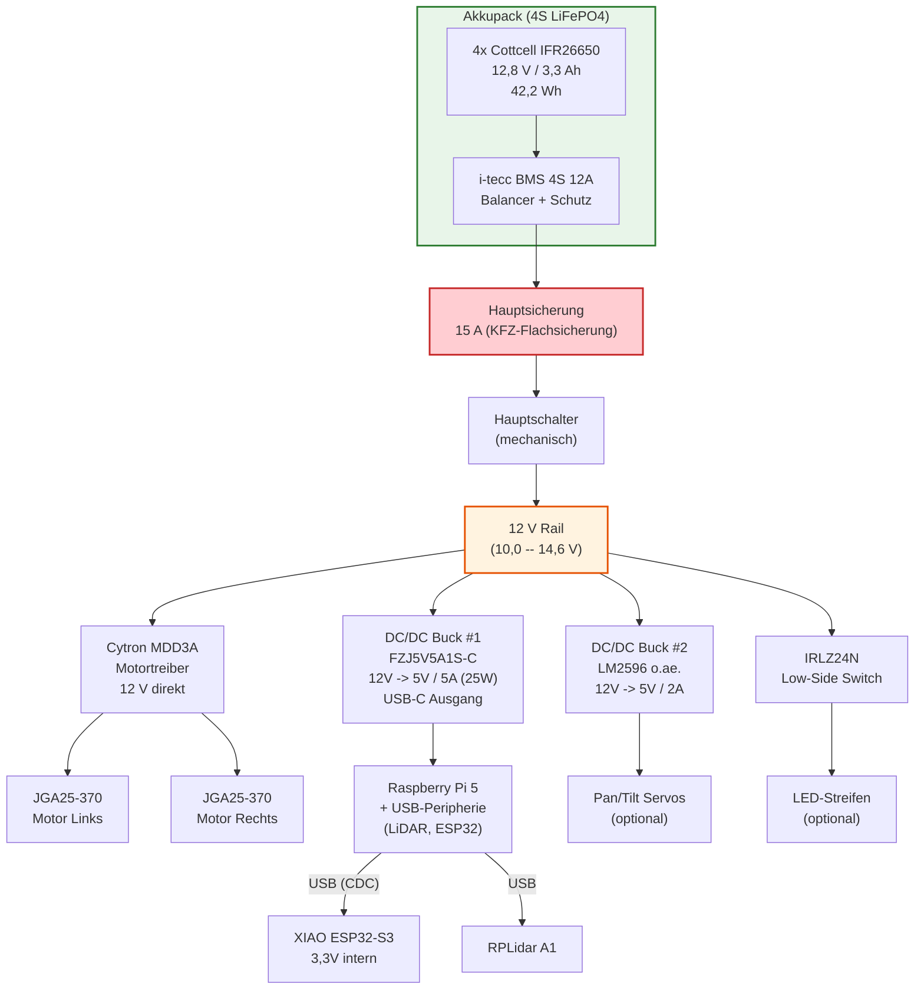
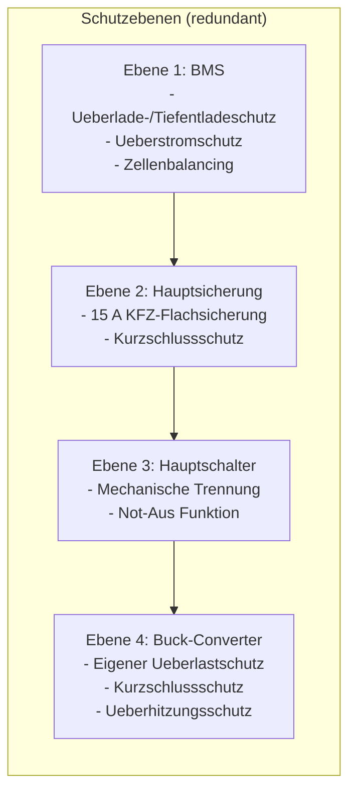
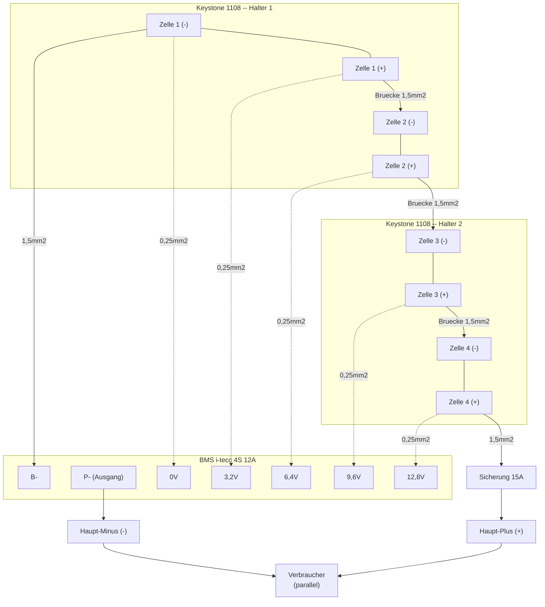
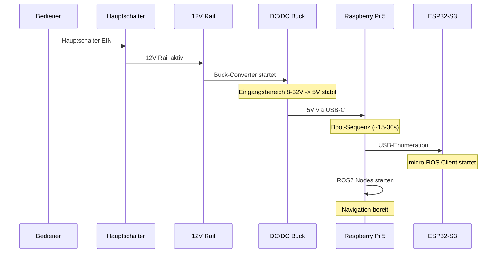

# 03 -- Stromversorgung und Akkusystem

## Uebersicht

Das Energiesystem des AMR basiert auf einem selbst konfektionierten 4S-LiFePO4-Akkupack mit integriertem Batteriemanagementsystem (BMS). Die Stromverteilung erfolgt ueber eine zentrale 12-V-Rail mit nachgeschalteten DC/DC-Wandlern fuer die verschiedenen Spannungsebenen. Das Design folgt dem Prinzip der galvanischen Trennung zwischen Leistungs- und Logikpfaden, um stoerungsfreien Betrieb des Navigationsstacks zu gewaehrleisten.

---

## 1 Akkupack-Design

### 1.1 Zellenchemie und Konfiguration

Das Akkupack verwendet **LiFePO4-Zellen** (Lithium-Eisenphosphat) in einer **4S1P-Konfiguration** (4 Zellen in Serie, 1 Parallel-Strang).

**Gewahlte Zelle: Cottcell IFR26650**

| Parameter                    | Wert                  |
| ---------------------------- | --------------------- |
| Zellenchemie                 | LiFePO4 (LFP)        |
| Bauform                      | 26650 (Flat Top)      |
| Nennspannung (je Zelle)      | 3,2 -- 3,3 V         |
| Kapazitaet (Hersteller)      | 3300 mAh              |
| Min. Kapazitaet              | 3200 mAh              |
| Entladeschlussspannung       | 2,0 V                 |
| Max. Dauerstrom (Entladung)  | 3C = 9,6 A            |
| Ladestrom                    | 0,3 -- 1,2 A          |
| Ladeschlussspannung          | 3,65 V                |
| Pluspol                      | Flach (Flat Top)      |
| Ladeverfahren                | CC/CV                 |
| Durchmesser                  | 26,10 mm +/- 0,15 mm |
| Hoehe                        | 66,00 mm +/- 0,20 mm |
| Gewicht                      | 86 g                  |
| Integrierter Schutz           | Nicht vorhanden       |

**Vorteile von LiFePO4 gegenueber Li-Ion (NMC/NCA):**

- Hoehere thermische Stabilitaet -- kein thermisches Durchgehen (Thermal Runaway) unter Normalbedingungen
- Laengere Zyklenlebensdauer (typisch 2000+ Zyklen vs. 500--800 bei Li-Ion)
- Kein Memory-Effekt
- Flachere Entladekurve -- stabilere Spannungsversorgung ueber den Entladezyklus
- Inherent sicherer durch stabile Kristallstruktur des Olivin-Gitters

**Pack-Kennwerte (4S1P):**

| Parameter                  | Wert                       |
| -------------------------- | -------------------------- |
| Konfiguration              | 4S1P                       |
| Nennspannung               | 12,8 V (4 x 3,2 V)        |
| Voll geladen               | 14,4 -- 14,6 V (4 x 3,65 V) |
| Entladeschlussspannung     | 8,0 V (4 x 2,0 V)         |
| Nennkapazitaet             | 3,3 Ah                     |
| Energieinhalt              | ca. 42,2 Wh (3,3 Ah x 12,8 V) |
| Max. Dauerstrom (Entladung)| 9,6 A (3C)                 |
| Gesamtgewicht (nur Zellen) | ca. 344 g (4 x 86 g)      |

### 1.2 Zellenhalterung

**Keystone 1108 -- Batteriehalter fuer 2x 26650**

| Parameter          | Wert                            |
| ------------------ | ------------------------------- |
| Ausfuehrung        | 2x 26650 (ohne PCB)            |
| Bauart             | SMD-Version mit Loetfahne       |
| Breite             | 56,0 mm                        |
| Hoehe              | 19,0 mm                        |
| Laenge             | 86,0 mm                        |
| Gewicht            | 0,015 kg                       |
| Hersteller         | Keystone                        |
| Bezugsquelle       | Reichelt Elektronik             |
| Stueckpreis        | 9,15 EUR                       |
| Benoetigte Menge   | 2 Stueck                       |

Die beiden Halter werden Ruecken an Ruecken oder nebeneinander zu einem festen Block verklebt. Die vergoldeten/vernickelten Kontakte bieten deutlich besseren Stromfluss als einfache Spiralfedern-Halter.

### 1.3 Batteriemanagementsystem (BMS)

**i-tecc BMS LiFePO4 4S 12A (12V)**

| Parameter                   | Wert                        |
| --------------------------- | --------------------------- |
| Modell                      | i-tecc BMS LiFePO 4S 12A   |
| Artikelnummer               | 5000724                     |
| Zellenchemie                | LiFePO4                     |
| Zellenzahl                  | 4S                          |
| Dauerstrom                  | 12 A                        |
| Ladeschlussspannung         | 14,4 V (4 x 3,6 V)         |
| Preis                       | 19,95 EUR                   |

**Funktionsumfang des BMS:**

- **Balancing**: Ueberwacht und gleicht die Einzelzellenspannungen waehrend des Ladevorgangs aus, um Zelldrift zu reduzieren
- **Ueberladeschutz**: Unterbricht den Ladevorgang bei Ueberschreitung der Ladeschlussspannung einer Einzelzelle
- **Tiefentladeschutz**: Unterbricht die Entladung bei Unterschreitung der Entladeschlussspannung
- **Ueberstromschutz**: Abschaltung bei Ueberschreitung des maximalen Entladestroms
- **Niedrige Eigenleistungsaufnahme**: Minimaler Ruhestrom, wichtig fuer lange Stand- und Lagerzeiten

> **Hinweis:** Da die IFR26650-Zellen keinen integrierten Schutz besitzen, ist das BMS die einzige Schutzinstanz. Der Betrieb ohne BMS ist nicht zulaessig.

---

## 2 Stromversorgungstopologie

### 2.1 Blockdiagramm der Stromverteilung



### 2.2 Spannungsebenen

| Ebene    | Quelle                     | Spannung (Bereich)     | Verbraucher                          |
| -------- | -------------------------- | ---------------------- | ------------------------------------ |
| 12 V     | Akkupack direkt (via BMS)  | 10,0 -- 14,6 V        | Motortreiber, MOSFET-Lasten          |
| 5 V #1   | DC/DC Buck (USB-C, 25 W)  | 5,0 V +/- 1%          | Raspberry Pi 5, USB-Peripherie       |
| 5 V #2   | DC/DC Buck (LM2596)       | 5,0 V +/- 5%          | Servos (optional)                    |
| 3,3 V    | ESP32-S3 intern (LDO)     | 3,3 V                 | Encoder-Logik, I2C-Bus, GPIO-Pegel   |

### 2.3 Design-Regeln

- **Getrennte 5-V-Rails**: Der Raspberry Pi 5 erhaelt einen eigenen, dedizierten DC/DC-Wandler. Motorstromspitzen koennen kurzzeitig mehrere Ampere betragen und wuerden bei gemeinsamer Versorgung den Pi resetten.
- **Sternpunkt-Masse**: Ein definierter Rueckstrompunkt fuer Power-GND. Von dort fuehren sternfoermig separate Massepfade zu Pi-Buck, Servo-Buck, Motortreiber und ESP32. Dies verhindert Masseschleifen und die Einkopplung von Motorstroerungen in die Logikpfade.
- **Servo-Power extern**: Servos beziehen ihre Versorgung ausschliesslich vom separaten Buck #2, niemals aus den USB-Ports des Pi oder vom ESP32.

---

## 3 DC/DC-Spannungswandler

### 3.1 Buck-Converter #1 -- Raspberry-Pi-Versorgung

**Modell: FZJ5V5A1S-C (EpheyIF)**

| Parameter                    | Wert                     |
| ---------------------------- | ------------------------ |
| Typ                          | DC-DC Step-Down Wandler  |
| Eingangsspannung             | 8 -- 32 V Gleichstrom    |
| Ausgangsspannung             | 5 V Gleichstrom          |
| Ausgangsstrom                | max. 5 A                 |
| Ausgangsleistung             | max. 25 W                |
| Umwandlungseffizienz         | bis 96%                  |
| Spannungsregelung            | +/- 1%                   |
| Lastregelung                 | +/- 5%                   |
| Welligkeit und Rauschen      | 30 mVp-p                 |
| Leerlaufverlust              | 0,15 W                   |
| Betriebstemperatur           | -25 bis +80 Grad C       |
| Wasserdichtigkeit            | IP68                     |
| Ausgangs-Verkabelungstyp     | USB-C                    |
| Eingangsverdrahtungstyp      | Drahtstuecke 20AWG       |
| Abmessungen                  | 46 x 27 x 14 mm         |
| Gewicht                      | 45 g                     |

**Schutzfunktionen (integriert):**

- Eingangs-Rueckwaertspolaritaetsschutz
- Ueberlastung / Ueberstrom
- Niederspannungsschutz
- Ueberhitzungsschutz
- Ausgangskurzschlussschutz

Der USB-C-Ausgang erkennt das Ladegeraet-Modell automatisch und ist kompatibel mit den Anforderungen des Raspberry Pi 5 (min. 5 V / 5 A via USB-C PD).

### 3.2 Buck-Converter #2 -- Servo-Versorgung (optional)

| Parameter          | Wert                            |
| ------------------ | ------------------------------- |
| Typ                | LM2596-basierter Step-Down      |
| Eingangsspannung   | 8 -- 35 V                       |
| Ausgangsspannung   | 5 V (einstellbar)               |
| Ausgangsstrom      | max. 3 A                        |
| Empfohlene Reserve | 2 A (fuer 2x MG90S Servo-Peaks) |

### 3.3 ESP32-S3 interne Spannungsregelung

Der XIAO ESP32-S3 wird ueber USB vom Raspberry Pi 5 versorgt (5 V). Der integrierte LDO-Regler auf dem XIAO-Board erzeugt die benoetigten 3,3 V fuer die Logikpegel (GPIO, Encoder, I2C).

---

## 4 Absicherung und Schutzkonzept

### 4.1 Sicherungshierarchie



### 4.2 Hauptsicherung

- **Typ**: 15 A KFZ-Flachsicherung
- **Position**: Direkt am Akkupack, zwischen Plus-Pol der letzten Zelle und der 12-V-Rail
- **Dimensionierung**: 15 A liegt ueber dem maximalen Dauerstrom des Systems (ca. 4--6 A), schuetzt aber zuverlaessig gegen Kurzschluss

### 4.3 Hauptschalter

- In Serie zur 12-V-Rail positioniert
- Mechanisch gut erreichbar am Chassis
- Dient als primaerer Ein-/Ausschalter und als Not-Aus

### 4.4 Freilaufdioden

- Fuer induktive Lasten am MOSFET-Low-Side-Switch (z.B. Relais, Spulen): 1N4007 parallel zur Last
- Fuer reine LED-Lasten: keine Freilaufdiode erforderlich
- Die Motoren werden ueber den Cytron MDD3A angesteuert, der interne Schutzschaltungen besitzt

### 4.5 Leitungsquerschnitte

| Pfad                               | Querschnitt       | Begruendung                            |
| ---------------------------------- | ------------------ | -------------------------------------- |
| Akku -> 12-V-Rail / Motortreiber   | 1,5 mm2            | Dauerstrom bis 10 A, kurze Wege        |
| BMS-Messleitungen (Balancer)       | 0,25 mm2           | Nur Messströme im uA-Bereich           |
| 5-V-Servo-Zuleitung               | 0,75 mm2           | Peakstroeme bis 2 A                    |
| Signalleitungen (PWM/Encoder/I2C) | duenn (ca. 0,14 mm2)| Nur Logikpegel, Twisted Pair bei Encoder |

---

## 5 Verkabelung des Akkupacks

### 5.1 Serienschaltung (4S)

Die vier Zellen werden in Serie geschaltet, um die Nennspannung von 12,8 V zu erreichen. Die Verkabelung erfolgt in fuenf definierten Schritten:

**Schritt 1 -- Mechanischer Aufbau:**
Die beiden Keystone-1108-Halter werden zu einem festen Block verklebt. Die Zellen werden erst nach vollstaendiger Verdrahtung eingesetzt.

**Schritt 2 -- Leistungsbruecken (1,5 mm2):**

```
Zelle 1 (-)  ----[B- am BMS]---- Haupt-Minus
Zelle 1 (+)  ---- Zelle 2 (-)
Zelle 2 (+)  ---- Zelle 3 (-)
Zelle 3 (+)  ---- Zelle 4 (-)
Zelle 4 (+)  ----[Sicherung 15A]---- Haupt-Plus
```

**Schritt 3 -- BMS-Messleitungen (0,25 mm2):**
Die Balancer-Leitungen werden an den Verbindungspunkten der Serienschaltung angeloetet:

| BMS-Anschluss | Messpunkt          | Spannung (ca.) |
| ------------- | ------------------- | -------------- |
| 0 V (Schwarz) | Minus Zelle 1       | 0 V            |
| Tap 1         | Plus Zelle 1        | 3,2 V          |
| Tap 2         | Plus Zelle 2        | 6,4 V          |
| Tap 3         | Plus Zelle 3        | 9,6 V          |
| Tap 4 (Rot)   | Plus Zelle 4        | 12,8 V         |

**Schritt 4 -- Leistungsanschluss am BMS:**

- Dickes Kabel (1,5 mm2) von Minus Zelle 1 an das Pad **B-** auf dem BMS
- Systemausgang: **P-** (BMS-Ausgang, geschuetzt) und **Haupt-Plus** (ueber Sicherung)

**Schritt 5 -- Verbraucher anschliessen:**
Am Akkuausgang (P- und Sicherung) werden parallel angeschlossen:

1. DC/DC-Wandler FZJ5V5A1S-C (USB-C fuer Raspberry Pi)
2. Cytron MDD3A Motortreiber (Schraubklemmen Power Input)
3. Optional: Buck #2 fuer Servos, MOSFET-Schaltstufe fuer LEDs

### 5.2 Verdrahtungsdiagramm



---

## 6 Energiebilanz und Laufzeitabschaetzung

### 6.1 Stromverbrauch der Hauptkomponenten

| Komponente               | Spannung | Strom (typ.)  | Strom (max.)  | Leistung (typ.) |
| ------------------------ | -------- | ------------- | ------------- | ---------------- |
| Raspberry Pi 5 (aktiv)   | 5 V      | 2,0 -- 3,0 A | 5,0 A         | 10 -- 15 W       |
| RPLidar A1               | 5 V      | 0,5 A         | 0,7 A         | 2,5 W            |
| XIAO ESP32-S3            | 5 V      | 0,1 A         | 0,3 A         | 0,5 W            |
| 2x JGA25-370 (Fahrt)     | 12 V     | 0,3 -- 0,8 A  | 2,0 A (Stall) | 3,6 -- 9,6 W     |
| Cytron MDD3A (Eigenverb.)| 12 V     | 0,02 A        | --            | 0,24 W           |
| DC/DC Wandler (Verluste) | --       | --            | --            | ca. 1 W          |
| BMS (Eigenverbrauch)     | 12,8 V   | < 0,001 A     | --            | < 0,01 W         |
| **Gesamt (Fahrbetrieb)** |          |               |               | **ca. 18 -- 28 W** |

### 6.2 Laufzeitabschaetzung

| Szenario                           | Leistung (geschaetzt) | Laufzeit (geschaetzt)       |
| ---------------------------------- | --------------------- | --------------------------- |
| Standby (Pi + LiDAR, keine Fahrt)  | ca. 15 W              | 42,2 Wh / 15 W = ca. 2,8 h |
| Normaler Fahrbetrieb               | ca. 22 W              | 42,2 Wh / 22 W = ca. 1,9 h |
| Volle Last (Navigation + Motoren)  | ca. 28 W              | 42,2 Wh / 28 W = ca. 1,5 h |

> **Hinweis:** Diese Werte sind konservative Schaetzungen. Die tatsaechliche Laufzeit haengt von Fahrtprofil, Hindernisdichte (haeufiges Beschleunigen/Bremsen) und Umgebungstemperatur ab. Der BMS-Tiefentladeschutz schaltet das System ab, bevor die Zellen Schaden nehmen.

### 6.3 Maximaler Systemstrom

Der maximale Gesamtstrom auf der 12-V-Rail betraegt im Normalbetrieb ca. 4 A (wie in der Akkupack-Dokumentation bestaetigt). Dies liegt deutlich unter der BMS-Dauerbelastbarkeit von 12 A und der Sicherungsbemessung von 15 A. Selbst bei blockierten Motoren (Stallstrom) bleibt das System innerhalb der Spezifikationen.

---

## 7 Ladekonzept

### 7.1 Ladegeraet

- **Empfohlenes Ladegeraet**: IMAX B6 (oder kompatibel)
- **Einstellung**: LiFe-Programm, 4S (3,3 V pro Zelle)
- **Ladeschlussspannung**: 14,4 V (4 x 3,6 V)
- **Empfohlener Ladestrom**: 0,5 -- 1,0 A (0,15C -- 0,3C)

### 7.2 Ladeprozedur

1. Roboter ausschalten (Hauptschalter trennen)
2. Ladegeraet an den Akku-Ausgang anschliessen (P- und Haupt-Plus)
3. LiFe-Programm, 4S, gewuenschten Ladestrom einstellen
4. Ladevorgang starten -- das BMS ueberwacht die Zellenbalancierung
5. Ladegeraet meldet "Voll" bei Erreichen von 14,4 V

### 7.3 BMS-Aufweckung

Falls am Ausgang (P-) nach dem Einlegen neuer Zellen keine Spannung anliegt, muss das BMS durch kurzes Anschliessen des Ladegeraets "geweckt" werden. Dies ist ein einmaliger Vorgang nach Erstinbetriebnahme oder nach einer Tiefentlade-Abschaltung.

---

## 8 Einschaltsequenz und Inbetriebnahme

### 8.1 Erstinbetriebnahme (einmalig)

1. Zellen in die Halter einlegen -- **Polung beachten!**
2. Sicherung (15 A) einsetzen
3. Spannung am Ausgang messen: Soll 10,0 -- 14,6 V
4. Falls keine Spannung: Ladegeraet kurz anschliessen (BMS-Aufweckung)
5. Akkupack mit IMAX B6 auf LiFe 4S vollstaendig laden

### 8.2 Messpunkte vor erstem Boot

| Messpunkt                     | Soll-Wert                  | Werkzeug         |
| ----------------------------- | -------------------------- | ---------------- |
| Akkupack-Ausgangsspannung     | 10,0 -- 14,6 V             | Multimeter (DC)  |
| 12-V-Rail (nach Sicherung)    | Gleich wie Akkuausgang     | Multimeter (DC)  |
| Buck #1 Ausgang (USB-C)       | 5,1 V +/- 0,1 V unter Last| Multimeter (DC)  |
| Buck #2 Ausgang (Servo)       | 5,0 V +/- 0,2 V           | Multimeter (DC)  |
| Gemeinsame Masse (Sternpunkt) | 0 Ohm zwischen allen GND  | Multimeter (Ohm) |

### 8.3 Normale Einschaltsequenz



---

## 9 Sicherheitshinweise

> **WARNUNG: LiFePO4-Zellen ohne integrierten Schutz**
>
> Die Cottcell IFR26650 Zellen besitzen keinen integrierten Schutz. Der Betrieb ohne funktionsfaehiges BMS ist **nicht zulaessig** und kann zu Brandentwicklung oder Explosion fuehren.

> **WARNUNG: Kurzschlussschutz**
>
> Kurzschluss an den Zellen oder am Akkuausgang kann trotz BMS und Sicherung zu extremen Stroemen fuehren. Alle Leitungsenden muessen isoliert sein. Werkzeuge mit isolierten Griffen verwenden.

> **WARNUNG: Polung**
>
> Beim Einlegen der Zellen in die Halter ist die korrekte Polung zu beachten. Falsch eingelegte Zellen fuehren zur Zerstoerung des BMS und koennen Brand verursachen.

### 9.1 Allgemeine Sicherheitsregeln

- Lithium-Zellen duerfen nur mit Schutzelektronik (BMS) betrieben werden
- Lithium-Zellen duerfen nur durch autorisiertes Fachpersonal verwendet werden
- Bei falscher Handhabung bzw. Kurzschluss kann dies zur Brandentwicklung oder Explosion fuehren
- Akkupack nicht uebermaessiger Hitze oder direkter Sonneneinstrahlung aussetzen
- Akkupack nicht mechanisch beschaedigen (Sturz, Quetschen, Durchstechen)
- Bei sichtbaren Schaeden (Aufblaehen, Verfaerbung, Geruch) das Pack sofort von der Last trennen und an einem feuerfesten Ort lagern

### 9.2 Lagerung

- Lagertemperatur: 10 -- 25 Grad C
- Lagerspannung: ca. 50% SOC (ca. 13,0 V fuer 4S LiFePO4)
- Bei Langzeitlagerung (> 3 Monate): Ladezustand alle 3 Monate pruefen

### 9.3 Transport

- LiFePO4-Akkus unterliegen den Gefahrgutvorschriften fuer Lithiumbatterien
- Transport nur mit Kurzschlussschutz (isolierte Kontakte, Sicherung entfernen)

---

## 10 Kostenaufstellung Energiesystem

| Komponente               | Modell / Typ                      | Menge | Einzelpreis | Gesamtpreis |
| ------------------------ | --------------------------------- | ----: | ----------: | ----------: |
| Akkuzellen               | Cottcell IFR26650 LiFePO4 3300mAh |     4 |    8,09 EUR |   32,36 EUR |
| Zellenhalterung          | Keystone 1108 (2-fach, Reichelt)  |     2 |    9,15 EUR |   18,30 EUR |
| BMS                      | i-tecc LiFePO4 4S 12A             |     1 |   19,95 EUR |   19,95 EUR |
| DC/DC Buck #1 (Pi)       | FZJ5V5A1S-C (USB-C, 5V/5A/25W)   |     1 |   12,99 EUR |   12,99 EUR |
| Sicherung + Halter       | KFZ-Flachsicherung 15 A           |     1 |    ca. 2 EUR|    ca. 2 EUR|
| Kabel + Schrumpfschlauch | 1,5 mm2 + 0,25 mm2                |     1 |    ca. 5 EUR|    ca. 5 EUR|
| Versand (geschaetzt)     | Diverse Haendler                  |     - |           - |   ca. 19 EUR|
| **Gesamt**               |                                   |       |             |**ca. 110 EUR**|

---

## 11 Zusammenfassung der Systemparameter

| Parameter                           | Wert                                  |
| ----------------------------------- | ------------------------------------- |
| Akkuchemie                          | LiFePO4 (Lithium-Eisenphosphat)       |
| Konfiguration                       | 4S1P                                  |
| Nennspannung                        | 12,8 V                                |
| Spannungsbereich                    | 8,0 -- 14,6 V                         |
| Kapazitaet                          | 3,3 Ah / 42,2 Wh                     |
| Max. Dauerstrom (Entladung)         | 9,6 A (3C, Zellenlimit) / 12 A (BMS) |
| Hauptsicherung                      | 15 A                                  |
| Spannungsebenen                     | 12 V, 5 V (2x), 3,3 V                |
| Systemverbrauch (typisch)           | 18 -- 28 W                            |
| Geschaetzte Laufzeit                | 1,5 -- 2,8 h                          |
| Ladegeraet                          | IMAX B6, LiFe 4S                      |
| Ladeschlussspannung                 | 14,4 V                                |
| Gesamtkosten Energiesystem          | ca. 110 EUR                           |
