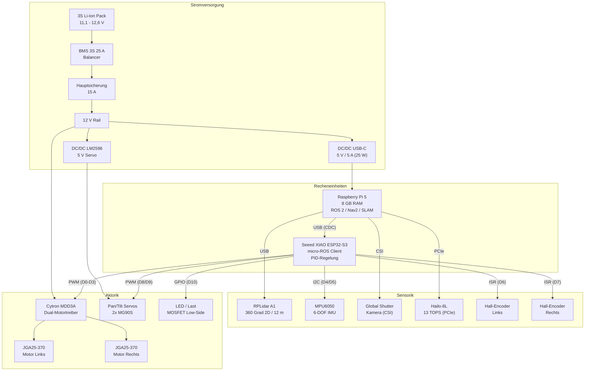
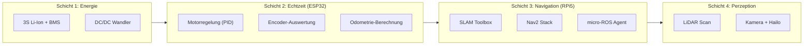
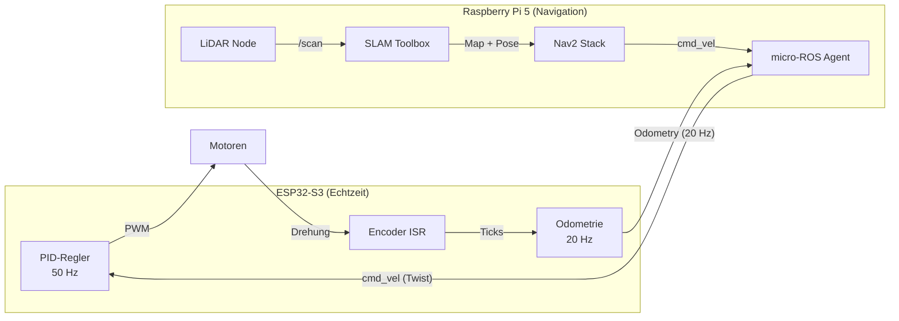

# 04 – Systemintegration, Pinbelegung & Stueckliste

**Dokumenttyp:** Referenzdokument fuer Nachbau und Wartung
**Stand:** 2025-12-19
**Bezugsdokumente:** `hardware/hardware-setup.md`, `hardware/config.h`, `hardware/kosten.md`

---

## Inhaltsverzeichnis

1. [Systemarchitektur-Uebersicht](#1-systemarchitektur-uebersicht)
2. [Vollstaendige Pinbelegung (XIAO ESP32-S3)](#2-vollstaendige-pinbelegung-xiao-esp32-s3)
3. [Raspberry Pi 5 Peripherie & USB-Topologie](#3-raspberry-pi-5-peripherie--usb-topologie)
4. [Kommunikationspfade und Datenfluss](#4-kommunikationspfade-und-datenfluss)
5. [Mechanische Eckdaten](#5-mechanische-eckdaten)
6. [Stueckliste (Bill of Materials)](#6-stueckliste-bill-of-materials)
7. [Inbetriebnahme-Checkliste](#7-inbetriebnahme-checkliste)
8. [Fehlersuche und haeufige Probleme](#8-fehlersuche-und-haeufige-probleme)

---

## 1. Systemarchitektur-Uebersicht

Das AMR-System folgt einer zweistufigen Architektur: Ein Raspberry Pi 5 uebernimmt die hochrangige Navigation (ROS 2, SLAM, Nav2), waehrend ein Seeed XIAO ESP32-S3 die Echtzeit-Motorregelung und Odometrie-Erfassung realisiert. Die Kommunikation zwischen beiden Ebenen erfolgt ueber micro-ROS via USB-Serial (UART-Transport).

### 1.1 Blockdiagramm – Gesamtsystem

### 1.2 Hierarchische Systemschichten

---

## 2. Vollstaendige Pinbelegung (XIAO ESP32-S3)

Die folgende Tabelle dokumentiert die vollstaendige Pinbelegung des Seeed XIAO ESP32-S3 gemaess `config.h`. Saemtliche Firmware-Defines referenzieren diese Zuordnung.

### 2.1 Pin-Mapping Gesamtuebersicht

| XIAO Pin | GPIO | Funktion | Modul | Signaltyp | LEDC-Kanal | Anmerkung |
|----------|------|----------|-------|-----------|------------|-----------|
| D0 | GPIO1 | Motor Links A (Vorwaerts) | Cytron MDD3A M1A | PWM | CH 1 | 20 kHz, 8 Bit |
| D1 | GPIO2 | Motor Links B (Rueckwaerts) | Cytron MDD3A M1B | PWM | CH 0 | 20 kHz, 8 Bit |
| D2 | GPIO3 | Motor Rechts A (Vorwaerts) | Cytron MDD3A M2A | PWM | CH 3 | 20 kHz, 8 Bit |
| D3 | GPIO4 | Motor Rechts B (Rueckwaerts) | Cytron MDD3A M2B | PWM | CH 2 | 20 kHz, 8 Bit |
| D4 | GPIO5 | I2C SDA | MPU6050 IMU | I2C | - | 3,3 V Pegel, Adresse 0x68 |
| D5 | GPIO6 | I2C SCL | MPU6050 IMU | I2C | - | 3,3 V Pegel, Pull-Up extern |
| D6 | GPIO43 | Encoder Links Phase A | Hall-Encoder JGA25-370 | Interrupt | - | ISR auf steigende Flanke |
| D7 | GPIO44 | Encoder Rechts Phase A | Hall-Encoder JGA25-370 | Interrupt | - | ISR auf steigende Flanke |
| D8 | GPIO7 | Servo Pan (Signal) | MG90S Pan | PWM | - | Power extern 5 V |
| D9 | GPIO8 | Servo Tilt (Signal) | MG90S Tilt | PWM | - | Power extern 5 V |
| D10 | GPIO9 | LED / MOSFET Gate | IRLZ24N Low-Side | PWM/Digital | CH 4 | 5 kHz, Pull-Down 100 kOhm |

### 2.2 PWM-Kanalzuordnung (ESP32 LEDC)

Die Firmware nutzt den ESP32-LEDC-Peripherieblock fuer die PWM-Erzeugung. Die A/B-Kanaele sind gegenueber der physischen Reihenfolge getauscht, um die korrekte Drehrichtung zu gewaehrleisten:

| LEDC-Kanal | Zugeordneter Pin | Funktion | Frequenz | Aufloesung |
|------------|------------------|----------|----------|------------|
| CH 0 | D1 (Motor Links B) | Rueckwaerts-PWM Links | 20 kHz | 8 Bit (0-255) |
| CH 1 | D0 (Motor Links A) | Vorwaerts-PWM Links | 20 kHz | 8 Bit (0-255) |
| CH 2 | D3 (Motor Rechts B) | Rueckwaerts-PWM Rechts | 20 kHz | 8 Bit (0-255) |
| CH 3 | D2 (Motor Rechts A) | Vorwaerts-PWM Rechts | 20 kHz | 8 Bit (0-255) |
| CH 4 | D10 (LED/MOSFET) | LED-Steuerung | 5 kHz | 8 Bit (0-255) |

**Hinweis:** Die PWM-Frequenz von 20 kHz liegt oberhalb der menschlichen Hoerschwelle – die Motoren erzeugen kein hoerbares PWM-Pfeifen.

### 2.3 I2C-Bus Konfiguration

| Parameter | Wert |
|-----------|------|
| SDA-Pin | D4 (GPIO5) |
| SCL-Pin | D5 (GPIO6) |
| Geraet | MPU6050 (6-DOF IMU) |
| Adresse | 0x68 |
| Logikpegel | 3,3 V |
| Pull-Up Widerstaende | 2,2 - 4,7 kOhm (extern, einmalig im Bus) |
| Entkopplung | 100 nF Keramikkondensator nahe IMU |
| Leitungslaenge | Maximal 20 cm empfohlen |

### 2.4 Encoder-Anschluss (A-only Konfiguration)

Das aktuelle Design verwendet nur Phase A der Hall-Encoder (Single-Channel). Phase B bleibt ungenutzt und muss am freien Kabelende isoliert werden.

| Signal | Pin | Kabelfarbe | Anmerkung |
|--------|-----|------------|-----------|
| Encoder Links Phase A | D6 | Gelb | Interrupt-faehig |
| Encoder Rechts Phase A | D7 | Gelb | Interrupt-faehig |
| Encoder Links Phase B | - | Gruen | **Nicht anschliessen, isolieren** |
| Encoder Rechts Phase B | - | Gruen | **Nicht anschliessen, isolieren** |
| Encoder VCC | 3,3 V | Rot | Aus ESP32 3V3-Pin oder extern |
| Encoder GND | GND | Schwarz | An Sternpunkt-Masse |

**Spannungshinweis:** Wenn die Encoder mit 3,3 V stabil arbeiten, kann VCC direkt vom ESP32 bezogen werden. Falls 5 V benoetigt werden, ist ein Pegelwandler (Level Shifter) oder Spannungsteiler fuer das A-Signal erforderlich, um die ESP32-Eingaenge (max. 3,3 V) zu schuetzen.

### 2.5 Motor-Verkabelung zum Cytron MDD3A

| Signal | XIAO Pin | Kabelfarbe | Ziel am Treiber |
|--------|----------|------------|-----------------|
| Motor Links Signal A | D0 | Rot | MDD3A M1A |
| Motor Links Signal B | D1 | Weiss | MDD3A M1B |
| Motor Rechts Signal A | D2 | Rot | MDD3A M2A |
| Motor Rechts Signal B | D3 | Weiss | MDD3A M2B |

**Dual-PWM Steuerprinzip:**
- Vorwaerts: `PWM_A > 0`, `PWM_B = 0`
- Rueckwaerts: `PWM_A = 0`, `PWM_B > 0`
- Stopp: `PWM_A = 0`, `PWM_B = 0`

Es werden keine separaten DIR-Pins benoetigt; die Drehrichtung ergibt sich aus der Wahl des aktiven PWM-Kanals.

---

## 3. Raspberry Pi 5 Peripherie & USB-Topologie

### 3.1 USB-Geraete

| USB-Port | Geraet | Device-Node | Protokoll | Bemerkung |
|----------|--------|-------------|-----------|-----------|
| USB 2.0/3.0 | XIAO ESP32-S3 | `/dev/ttyACM*` | micro-ROS Serial | CDC-Klasse, 115200 Baud |
| USB 2.0/3.0 | RPLidar A1 | `/dev/ttyUSB*` oder `/dev/ttyACM*` | UART (CP2102/CH340) | Adapterabhaengig |

**udev-Regeln fuer stabile Geraetezuordnung:**

Fuer einen zuverlaessigen Betrieb ueber Neustarts hinweg sollten udev-Regeln erstellt werden, die serielle Geraete anhand ihrer VID/PID auf feste Alias-Pfade mappen:

- `/dev/amr_esp32` fuer den XIAO ESP32-S3
- `/dev/amr_lidar` fuer den RPLidar A1

### 3.2 CSI-Kamera

| Parameter | Wert |
|-----------|------|
| Anschluss | CSI-Connector (Flachbandkabel) |
| Kabel | Standard-Mini 500 mm |
| Kameramodul | Raspberry Pi Global Shutter Camera |
| Objektiv | PT361060M3MP12 CS-Mount 6 mm |

**Mechanischer Hinweis:** Das CSI-Flachbandkabel muss zugentlastet verlegt werden, um Kontaktprobleme durch Vibrationen zu vermeiden.

### 3.3 PCIe-Erweiterung

| Parameter | Wert |
|-----------|------|
| Anschluss | PCIe (M.2 via HAT) |
| Modul | Hailo-8L AI Kit |
| Rechenleistung | 13 TOPS |
| Einsatz | Echtzeit-Objekterkennung |
| Kuehlung | Aktive Kuehlung empfohlen (Active Cooler) |

---

## 4. Kommunikationspfade und Datenfluss

### 4.1 Kommunikationsmatrix

### 4.2 Datenflusstabelle

| Pfad | Protokoll | Datentyp | Frequenz | Richtung |
|------|-----------|----------|----------|----------|
| RPi5 → ESP32 | micro-ROS / USB Serial | `geometry_msgs/Twist` (cmd_vel) | Bedarfsgesteuert | Downstream |
| ESP32 → RPi5 | micro-ROS / USB Serial | `nav_msgs/Odometry` | 20 Hz | Upstream |
| RPLidar → RPi5 | USB Serial | LaserScan (`/scan`) | 5-10 Hz | Upstream |
| Kamera → RPi5 | CSI | Bilddaten | 30 fps | Upstream |
| ESP32 intern | I2C | IMU-Rohdaten (MPU6050) | Konfigurierbar | Intern |
| ESP32 intern | GPIO Interrupt | Encoder-Ticks | Ereignisgesteuert | Intern |

### 4.3 micro-ROS Transportschicht

| Parameter | Wert |
|-----------|------|
| Transport | Serial (USB CDC) |
| ROS-Distribution | Humble |
| Agent-Seite | Raspberry Pi 5 (Docker-Container) |
| Client-Seite | XIAO ESP32-S3 |
| Failsafe-Timeout | 1000 ms |
| Regelschleife | 100 Hz (Firmware-Loop) |

**Designentscheidung:** micro-ROS ueber USB-Serial wurde gegenueber WiFi/Ethernet gewaehlt, da serielle Verbindungen deterministisches Timing bieten und keine Latenzschwankungen durch Netzwerk-Stacks entstehen.

---

## 5. Mechanische Eckdaten

### 5.1 Roboterfotos

| Ansicht | Datei |
|---------|-------|
| Draufsicht |  |
| Seitenansicht |  |

### 5.2 Kinematische Parameter

Alle Werte entsprechen den Defines in `config.h` und sind in SI-Einheiten (REP-103) angegeben:

| Parameter | Symbol | Wert | Einheit | Define in config.h |
|-----------|--------|------|---------|-------------------|
| Raddurchmesser | d | 0,065 | m (65 mm) | `WHEEL_DIAMETER` |
| Radradius | r | 0,0325 | m (32,5 mm) | `WHEEL_RADIUS` |
| Spurbreite (Wheelbase) | L | 0,178 | m (178 mm) | `WHEEL_BASE` |
| Radumfang | C | 0,2042 | m (204,2 mm) | `WHEEL_CIRCUMFERENCE` |

### 5.3 Encoder-Kalibrierung

| Parameter | Links | Rechts | Einheit |
|-----------|-------|--------|---------|
| Ticks pro Umdrehung | 374,3 | 373,6 | Ticks/Rev |
| Meter pro Tick | 0,000546 | 0,000547 | m/Tick |
| Kalibrierungsstatus | Vorlaeufig | Vorlaeufig | - |
| Kalibrierungsmethode | 10-Umdrehungen-Test | 10-Umdrehungen-Test | - |

**Hinweis:** Die Encoder-Werte sind als vorlaeufig gekennzeichnet und muessen vor der finalen Inbetriebnahme per UMBmark-Test validiert werden. Bei Aenderungen an Raedern, Getriebe oder Encoder-Setup ist eine Neukalibrierung zwingend erforderlich.

### 5.4 Chassis

| Parameter | Wert |
|-----------|------|
| Material | Aluminium 2 mm |
| Bauform | Doppelplattform (stapelbar) |
| Stuetzrad | Kugelrolle (Carbon-Stahl) |
| Herkunft | Roboduino Roboter-Chassis (AliExpress) |

### 5.5 Regelungstechnische Parameter

| Parameter | Wert | Define |
|-----------|------|--------|
| Regelschleifenfrequenz | 100 Hz (10 ms Zykluszeit) | `LOOP_RATE_HZ` |
| PWM-Frequenz (Motoren) | 20 kHz | `MOTOR_PWM_FREQ` |
| PWM-Aufloesung | 8 Bit (0-255) | `MOTOR_PWM_BITS` |
| Motor-Totzone (Deadzone) | PWM 35 | `PWM_DEADZONE` |
| Failsafe-Timeout | 1000 ms | `FAILSAFE_TIMEOUT_MS` |
| Zielgeschwindigkeit (Nav2) | 0,4 m/s | nav2_params.yaml |
| Positionstoleranz | 10 cm (xy), 8 Grad (Gier) | nav2_params.yaml |
| Kartenaufloesung | 5 cm | mapper_params.yaml |

---

## 6. Stueckliste (Bill of Materials)

### 6.1 Beschaffte Komponenten

**Gesamtkosten: 482,48 EUR** (Budget: < 500 EUR, Reserve: 17,52 EUR)

#### Kategorie A: Rechenleistung & Sensorik (Intelligence & Vision)

| Pos. | Bezeichnung | Menge | Einzelpreis | Gesamtpreis | Bezugsquelle |
|------|-------------|-------|-------------|-------------|--------------|
| A1 | Raspberry Pi 5 (8 GB RAM) | 1 | 82,90 EUR | 82,90 EUR | BerryBase |
| A2 | RPLidar A1 (360 Grad 2D-Laserscanner, 12 m) | 1 | 89,90 EUR | 89,90 EUR | BerryBase |
| A3 | Raspberry Pi Global Shutter Kamera | 1 | 58,90 EUR | 58,90 EUR | BerryBase |
| A4 | Objektiv PT361060M3MP12 CS-Mount 6 mm | 1 | 27,50 EUR | 27,50 EUR | Botland |
| A5 | Hailo-8L AI Kit (TPU, 13 TOPS) | 1 | 73,90 EUR | 73,90 EUR | Welectron |
| A6 | Kamerakabel Standard-Mini 500 mm | 1 | 3,50 EUR | 3,50 EUR | BerryBase |
| | | | **Zwischensumme** | **336,60 EUR** | |

#### Kategorie B: Mechanik & Antrieb (Aktorik)

| Pos. | Bezeichnung | Menge | Einzelpreis | Gesamtpreis | Bezugsquelle |
|------|-------------|-------|-------------|-------------|--------------|
| B1 | JGA25-370 Getriebemotor 12 V 170 RPM mit Encoder | 2 | 10,19 EUR | 20,37 EUR | AliExpress |
| B2 | Cytron MDD3A (Dual-Motortreiber 16 V / 3 A) | 1 | 8,50 EUR | 8,50 EUR | Botland |
| B3 | Roboduino Roboter-Chassis (Alu 2 mm, doppelt) | 1 | 16,44 EUR | 16,44 EUR | AliExpress |
| B4 | Kugelrolle / Caster (Carbon-Stahl) | 5 | 0,20 EUR | 0,99 EUR | AliExpress |
| B5 | PTZ-Halterung 2-Achsen Pan/Tilt | 1 | 3,85 EUR | 3,85 EUR | AliExpress |
| B6 | MG90S Servo (Metallgetriebe) | 2 | 1,85 EUR | 3,69 EUR | AliExpress |
| B7 | BMS Schutzplatine 3S 25 A Li-Ion Balance | 2 | 2,79 EUR | 5,57 EUR | AliExpress |
| B8 | SanDisk microSDXC 128 GB Extreme (190 MB/s) | 1 | 20,50 EUR | 20,50 EUR | Botland |
| B9 | Verbindungskabel Buchse-Buchse 30 cm (40 St.) | 1 | 2,00 EUR | 2,00 EUR | Botland |
| B10 | DC/DC Wandler 12 V/24 V auf 5 V USB-C (25 W) | 1 | 11,12 EUR | 11,12 EUR | Amazon |
| | | | **Zwischensumme** | **93,03 EUR** | |

#### Kategorie C: Infrastruktur & Zubehoer

| Pos. | Bezeichnung | Menge | Einzelpreis | Gesamtpreis | Bezugsquelle |
|------|-------------|-------|-------------|-------------|--------------|
| C1 | Netzteil 27 W USB-C (weiss) | 1 | 12,40 EUR | 12,40 EUR | BerryBase |
| C2 | Active Cooler (Luefter fuer Pi 5) | 1 | 6,30 EUR | 6,30 EUR | BerryBase |
| C3 | Hitzebestaendiger Schrumpfschlauch (15 m) | 1 | 1,44 EUR | 1,44 EUR | AliExpress |
| C4 | PVC-Huelle fuer 18650-Zellen | 1 | 1,26 EUR | 1,26 EUR | AliExpress |
| C5 | Inspektionsspiegel 360 Grad | 1 | 2,62 EUR | 2,62 EUR | AliExpress |
| C6 | 18650 Lithium-Batteriehalter (100 St.) | 1 | 2,26 EUR | 2,26 EUR | AliExpress |
| C7 | Schweissdraht / Litzen | 1 | 0,80 EUR | 0,80 EUR | AliExpress |
| C8 | Wasserdichte Steckverbinder | 1 | 1,28 EUR | 1,28 EUR | AliExpress |
| C9 | Schraubstock magnetisch | 1 | 3,52 EUR | 3,52 EUR | AliExpress |
| C10 | Werkzeugtasche Hueftgurt | 1 | 3,16 EUR | 3,16 EUR | AliExpress |
| C11 | Diamant-Trennscheiben 22 mm (12 St.) | 1 | 0,99 EUR | 0,99 EUR | AliExpress |
| C12 | Edelstahl-Lineal | 1 | 1,89 EUR | 1,89 EUR | AliExpress |
| | | | **Zwischensumme** | **37,92 EUR** | |

#### Versandkosten

| Haendler | Betrag |
|----------|--------|
| Welectron (DHL Warenpost) | 4,95 EUR |
| Botland (2x Bestellung) | 9,98 EUR |
| **Summe Versand** | **14,93 EUR** |

### 6.2 Kostenstruktur

| Kategorie | Betrag | Anteil |
|-----------|--------|--------|
| Intelligence & Vision | 336,60 EUR | 70 % |
| Mechanik & Antrieb | 93,03 EUR | 19 % |
| Infrastruktur & Werkzeug | 37,92 EUR | 8 % |
| Versand | 14,93 EUR | 3 % |
| **Gesamt** | **482,48 EUR** | **100 %** |

### 6.3 Bereits vorhandene Komponenten (nicht in Gesamtkosten enthalten)

| Bezeichnung | Geschaetzter Wert | Bemerkung |
|-------------|-------------------|-----------|
| Samsung 35E 18650-Zellen (3S-Konfiguration) | ~15 EUR | Akku-Pack |
| Seeed XIAO ESP32-S3 | ~8 EUR | Mikrocontroller |
| MPU6050 IMU-Modul | ~3 EUR | Traegheitssensor |
| Loetmaterial, Schrauben, Kleinteile | ~5 EUR | Pauschal |
| **Summe vorhandener Teile** | **~31 EUR** | |

**Realistische Gesamtkosten inkl. vorhandener Teile: ~513 EUR**

### 6.4 Budget-Bewertung

| Kriterium | Ziel | Ergebnis | Status |
|-----------|------|----------|--------|
| Beschaffte Gesamtkosten | < 500 EUR | 482,48 EUR | Eingehalten |
| Budgetreserve | > 0 EUR | 17,52 EUR | Vorhanden |
| Realistische Gesamtkosten | - | ~513 EUR | Inkl. Vorhandenem |

---

## 7. Inbetriebnahme-Checkliste

Die folgende Checkliste ist sequentiell abzuarbeiten. Jeder Abschnitt setzt den erfolgreichen Abschluss des vorherigen voraus.

### 7.1 Schritt 1: Stromversorgung pruefen (vor erstem Boot)

- [ ] Akkupack geladen: Spannung am 12 V Rail zwischen 11,1 V und 12,6 V messen
- [ ] Hauptsicherung (15 A) korrekt eingesetzt und nahe am Akku positioniert
- [ ] Hauptschalter funktionsfaehig und gut erreichbar montiert
- [ ] DC/DC-Wandler fuer Pi: 5,1 V +/- 0,1 V **unter Last** messen (Pi angeschlossen und bootend)
- [ ] DC/DC-Wandler fuer Servos (optional): 5,0 V +/- 0,2 V messen
- [ ] Sternpunkt-Masse pruefen: Pi-GND, Buck-GND, Motortreiber-GND, ESP32-GND alle verbunden
- [ ] Keine Kurzschluesse auf 12 V Rail (Widerstandsmessung vor Einschalten)

### 7.2 Schritt 2: ESP32 Grundfunktion

- [ ] ESP32-S3 ueber USB an Pi angeschlossen
- [ ] Firmware mit `pio run -t upload` geflasht (921600 Baud)
- [ ] Serieller Monitor zeigt Boot-Meldung (`pio run -t monitor`, 115200 Baud)
- [ ] USB-Device enumeriert am Pi (`/dev/ttyACM*`)

### 7.3 Schritt 3: Motor-Checks (ohne ROS)

- [ ] Motortreiber Cytron MDD3A erhaelt 12 V Versorgungsspannung
- [ ] PWM-Pins D0-D3 korrekt mit MDD3A M1A/M1B/M2A/M2B verbunden
- [ ] Motor Links: Drehrichtung bei PWM auf D0 = vorwaerts (plausibel pruefen)
- [ ] Motor Rechts: Drehrichtung bei PWM auf D2 = vorwaerts (plausibel pruefen)
- [ ] Beide Motoren gleichzeitig: Roboter faehrt geradeaus (nicht kurvenfahrend)
- [ ] PWM-Deadzone beachtet: Motoren laufen erst ab PWM > 35 an

### 7.4 Schritt 4: Encoder-Checks

- [ ] Encoder-VCC und GND angeschlossen (3,3 V oder 5 V mit Pegelwandler)
- [ ] Encoder Links Phase A an Pin D6 (gelbes Kabel)
- [ ] Encoder Rechts Phase A an Pin D7 (gelbes Kabel)
- [ ] Phase B (gruenes Kabel) an beiden Encodern **isoliert** (nicht angeschlossen)
- [ ] Bei langsamer Handdrehung: Ticks zaehlen stabil hoch (keine Spikes bei Stillstand)
- [ ] Tick-Richtung: Positive Ticks bei Vorwaertsdrehung

### 7.5 Schritt 5: I2C / IMU (optional)

- [ ] MPU6050 an D4 (SDA) und D5 (SCL) angeschlossen
- [ ] VCC = 3,3 V, 100 nF Entkopplungskondensator nahe IMU
- [ ] I2C-Scan erkennt Geraet an Adresse 0x68
- [ ] Pull-Up Widerstaende (2,2-4,7 kOhm) vorhanden (nur einmal im Bus)

### 7.6 Schritt 6: LiDAR-Check

- [ ] RPLidar A1 per USB am Pi angeschlossen
- [ ] Geraet enumeriert am Pi (`lsusb` zeigt den Adapter)
- [ ] Serielles Device vorhanden (`/dev/ttyUSB*` oder `/dev/ttyACM*`)
- [ ] Mechanische Lage: LiDAR hoch genug montiert, keine Kabel im 360-Grad-Scanbereich
- [ ] Test-Scan: `/scan` Topic laesst sich in ROS 2 erzeugen

### 7.7 Schritt 7: micro-ROS Verbindung

- [ ] micro-ROS Agent auf Pi gestartet (Docker-Container)
- [ ] Agent erkennt ESP32 ueber `/dev/ttyACM*`
- [ ] Topic `/odom` wird vom ESP32 publiziert (20 Hz)
- [ ] Topic `/cmd_vel` wird vom ESP32 empfangen
- [ ] Failsafe: Motoren stoppen nach 1000 ms ohne `cmd_vel`

### 7.8 Schritt 8: Gesamtsystemtest

- [ ] Alle Sensoren und Aktoren gleichzeitig aktiv
- [ ] SLAM Toolbox erzeugt Karte aus LiDAR-Daten
- [ ] Nav2 sendet Fahrbefehle, Roboter folgt Pfad
- [ ] Odometrie-Drift akzeptabel (UMBmark-Test durchfuehren)
- [ ] Notaus: Hauptschalter trennt zuverlaessig alle Verbraucher

---

## 8. Fehlersuche und haeufige Probleme

### 8.1 Stromversorgung

| Problem | Moegliche Ursache | Loesung |
|---------|-------------------|---------|
| Pi startet nicht / bootet staendig neu | 5 V Buck-Spannung zu niedrig unter Last | Spannung unter Last messen; Buck-Wandler mit ausreichend Strom (mind. 5 A) verwenden |
| Motoren ruckeln bei hoher Last | Spannungseinbruch auf 12 V Rail | Akku laden; Leitungsquerschnitt pruefen (mind. 1,5 mm2) |
| ESP32 resetet waehrend Motoranlauf | Gemeinsame Masse fehlt oder unzureichend | Sternpunkt-Masse pruefen; dedizierte GND-Leitung |

### 8.2 Motoren & Treiber

| Problem | Moegliche Ursache | Loesung |
|---------|-------------------|---------|
| Motor dreht in falsche Richtung | PWM-Kanaele A/B vertauscht | LEDC-Kanalzuordnung in config.h pruefen (A und B getauscht) |
| Motor reagiert nicht unterhalb PWM ~35 | Normale Motor-Totzone | `PWM_DEADZONE = 35` ist korrekt; Firmware kompensiert automatisch |
| Nur ein Motor laeuft | Kabelbruch oder Pin-Zuordnung falsch | Verkabelung gegen Pin-Mapping-Tabelle pruefen |

### 8.3 Encoder

| Problem | Moegliche Ursache | Loesung |
|---------|-------------------|---------|
| Ticks zaehlen nicht | Encoder-VCC fehlt | VCC-Leitung pruefen (3,3 V oder 5 V) |
| Sporadische Ticks bei Stillstand | Elektromagnetische Stoerung | Twisted-Pair-Kabel verwenden; Leitungen von Motorleitungen trennen |
| Tick-Anzahl pro Umdrehung weicht ab | Encoder nicht kalibriert | 10-Umdrehungen-Test wiederholen; `TICKS_PER_REV_*` anpassen |
| Negative Ticks bei Vorwaertsfahrt | Phase A/B oder Motorpolaritaet vertauscht | Motorkabel tauschen oder Encoder-Pin-Zuordnung aendern |

### 8.4 micro-ROS / Kommunikation

| Problem | Moegliche Ursache | Loesung |
|---------|-------------------|---------|
| Agent findet ESP32 nicht | Falsches Device, USB-Kabel ohne Daten | `/dev/ttyACM*` pruefen; Datenkabel verwenden (nicht nur Ladekabel) |
| Odometrie-Topic fehlt | micro-ROS Client nicht initialisiert | Seriellen Monitor pruefen; Firmware neu flashen |
| Motoren stoppen ploetzlich | Failsafe-Timeout (1000 ms) ausgeloest | `cmd_vel` Publish-Rate erhoehen; USB-Verbindung pruefen |
| Hohe Latenz in der Steuerung | USB-Hub oder Bandbreite ueberlastet | Direkte USB-Verbindung verwenden; udev-Regeln setzen |

### 8.5 LiDAR

| Problem | Moegliche Ursache | Loesung |
|---------|-------------------|---------|
| Kein `/scan` Topic | USB-Adapter nicht erkannt | `lsusb` pruefen; Treiber fuer CP2102/CH340 installieren |
| Artefakte in der Karte | Kabel oder Chassis im Scanbereich | LiDAR-Montagehoehe anpassen; Kabel sauber verlegen |
| Rotation stoppt | Unzureichende Stromversorgung am USB-Port | Externen USB-Hub mit eigener Stromversorgung verwenden |

---

*Dokumentation erstellt: 2025-12-19 | Projekt: AMR Bachelor-Thesis | Quelle: hardware-setup.md, config.h, kosten.md*
