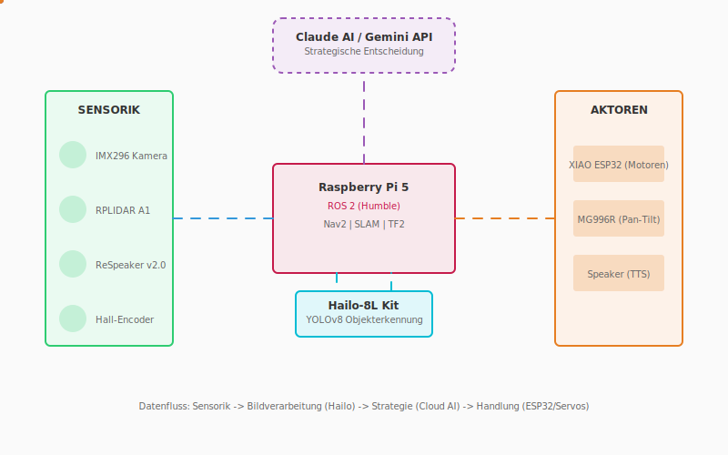
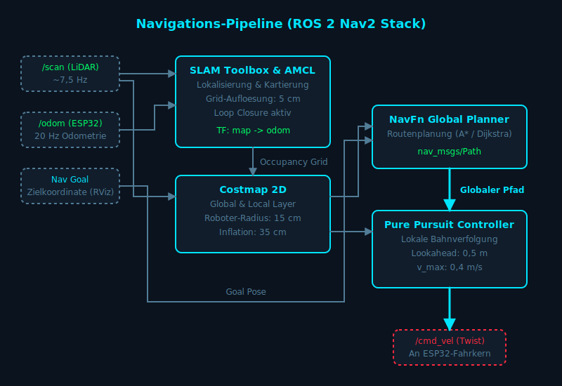
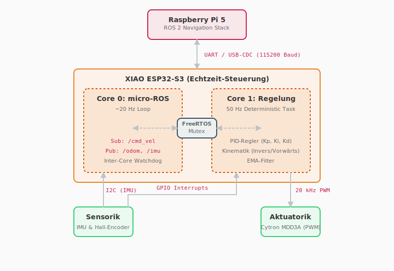
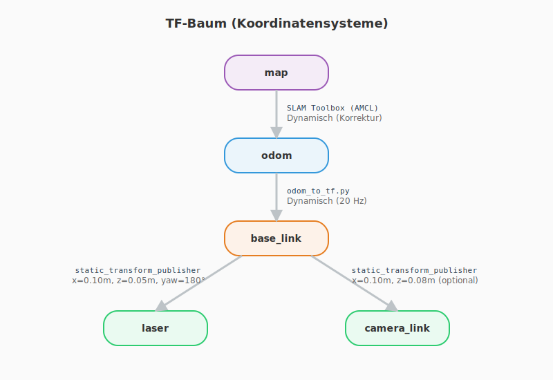

<!-- PDF: pandoc amr_vortrag.md -t beamer -o amr_vortrag.pdf --slide-level=2 --pdf-engine=xelatex -V aspectratio=169  -->

## Problemstellung und Lösungsmodell

**Problem:** Klassische Kleinladungsträger-Transporte (KLT) binden Personalressourcen. Industrielle Autonome Mobile Roboter (AMR) kosten oft > 25.000 EUR und sind für einfache KLT-Aufgaben überdimensioniert.

**Messgröße/Modell:** Ein Low-Cost-System (~500 EUR Hardwarekosten) erfordert eine strikte Aufgabentrennung zwischen harter Echtzeit (Motorregelung) und rechenintensiver High-Level-Navigation.

**Konsequenz:** Wir verteilen die Aufgabenstränge auf spezialisierte Knoten. Im Diagramm siehst du die resultierende Architektur: Lokale Sensorik und Vorverarbeitung (Hailo/RPi5) speisen eine Cloud-KI für strategische Entscheidungen, bevor Low-Level-Aktoren (ESP32/Servos) die Handlung physisch ausführen.

---

## Das Gesamtsystem im Überblick

Im Diagramm erkennst du vier zentrale Säulen, die den Datenfluss definieren:

{width=85%}

1.  **Sensorik:** Erfasst die physischen Rohdaten (Bild, Laser, Audio, Wegstrecke).
2.  **Lokale Verarbeitung (Raspberry Pi 5 & Hailo):** Aggregiert Sensordaten, berechnet die 2D-Karte und extrahiert Objekte.
3.  **Strategische Entscheidung (Cloud AI):** Bewertet die vorverarbeiteten semantischen Daten und plant das High-Level-Verhalten.
4.  **Aktoren:** Wandeln die digitalen Stellbefehle in physische Bewegung und Sprachausgabe um.

**Datenfluss-Regel:** Sensorik $\rightarrow$ Bildverarbeitung (Hailo) $\rightarrow$ Strategie (Cloud AI) $\rightarrow$ Handlung (ESP32/Servos).

---

## 1. Sensorik: Die Eingabe-Ebene

Die Sensorik liefert die Rohdaten-Grundlage. Wir erfassen Umgebung und Eigenbewegung durch vier Hauptkomponenten:

* **RPLIDAR A1:** Ein 2D-Laserscanner tastet die Umgebung in 360° ab. Er liefert Scandaten bei ca. 7,6 Hz (Referenz: > 5 Hz gefordert) bis zu einer Reichweite von 12 m.
* **IMX296 Kamera:** Diese Global-Shutter-Kamera liefert Bilder mit 1456x1088 Pixeln bei 15 fps über eine v4l2loopback-Bridge.
* **ReSpeaker v2.0:** Ein Mikrofon-Array nimmt Umgebungsgeräusche oder Sprachbefehle auf (Audio-In).
* **Hall-Encoder:** Integriert in die JGA25-370 Motoren. Sie nutzen Quadratur-Dekodierung und liefern ~748 Ticks pro Radumdrehung.

---

## 2. Lokale Verarbeitung: RPi 5 und Hailo

Der Raspberry Pi 5 aggregiert alle Datenströme und delegiert rechenintensive KI-Tasks an spezialisierte Hardware.

{width=65%}

* **ROS 2 Humble (RPi 5):** Läuft in einem Docker-Container im Host-Network-Modus. Der Nav2-Stack und die SLAM Toolbox berechnen hier die lokale Pfadplanung und eine 2D-Karte mit 5 cm Auflösung.
* **Hailo-8L Kit:** Beschleunigt die Bildverarbeitung. Ein YOLOv8-Modell läuft auf diesem PCIe-Beschleuniger und erkennt Objekte im Videostream der IMX296-Kamera in Echtzeit.

**Beobachtung:** Die CPU des Raspberry Pi 5 limitiert die Framerate bei reiner Software-Inferenz.
**Daten:** Die Auslagerung der YOLOv8-Inferenz auf die Hailo-8L NPU entlastet den Host-Prozessor maßgeblich.
**Regel:** Edge-KI erfordert dedizierte Beschleuniger-Hardware für Latenzkritische Bildverarbeitungsprozesse.

---

## 3. Strategische Entscheidung: Cloud AI

Die lokale Ebene bewältigt die reaktive Navigation (z.B. Nothalt vor statischen Hindernissen). Komplexe, kontextbezogene Entscheidungen wandern in die Cloud.

* **Claude AI / Gemini API:** Empfängt strukturierte JSON-Daten (erkannte Objekte vom Hailo, aktuelle Koordinaten vom SLAM, Audio-Transkripte vom ReSpeaker).
* **Aufgabe:** Löst logische Blockaden. Erkennt YOLOv8 beispielsweise einen "Gabelstapler" im Korridor, entscheidet die Cloud-KI basierend auf Fabrik-Richtlinien, ob der Roboter warten, eine alternative Route berechnen oder über den TTS-Speaker eine Warnung ausgeben soll.

---

## 4. Aktoren: Die physische Ausführung

Die Befehle aus der Cloud oder der lokalen Nav2-Instanz übersetzt die unterste Ebene in deterministische Handlungen.

{width=65%}

* **XIAO ESP32-S3:** Ein Dual-Core-Mikrocontroller. Core 0 managt die micro-ROS-Kommunikation bei 115200 Baud über UART, während Core 1 die Motorregelung mittels PID-Regler deterministisch bei 50 Hz ausführt.
* **Antrieb:** Ein Cytron MDD3A Dual-Motortreiber setzt die PWM-Signale (20 kHz) für die Antriebsmotoren um.
* **MG996R (Pan-Tilt):** Zwei Servomotoren richten die Kamera und den LiDAR aktiv aus, um tote Winkel zu inspizieren.
* **Speaker (TTS):** Gibt Audiosignale oder von der KI generierte Sprachausgaben wieder.

---

## Berechnungsgrundlage der Aktorik

Um die High-Level-Geschwindigkeitsbefehle (`/cmd_vel`) in Radgeschwindigkeiten umzurechnen, nutzen wir die Inverskinematik.

Wir leiten die Sollgeschwindigkeiten für das linke ($\omega_l$) und rechte ($\omega_r$) Rad wie folgt ab:

$$\omega_l = \frac{v - \omega \cdot \frac{L}{2}}{r}$$
$$\omega_r = \frac{v + \omega \cdot \frac{L}{2}}{r}$$

* $v$: Translationsgeschwindigkeit (Zielwert Nav2: 0,4 m/s)
* $\omega$: Rotationsgeschwindigkeit
* $L$: Spurbreite (Referenz: 178 mm)
* $r$: Radradius (Kalibriert: 32,835 mm)

---

## Validierung und Limitierungen

**Evidenz:**
Die Systemkomponenten sind durch experimentelle Daten validiert.
* Die systematische UMBmark-Kalibrierung reduzierte Odometriefehler um den Faktor 10 bis 20.
* Der PID-Regler auf dem ESP32 erreicht stabile 50 Hz mit einem Jitter von < 2 ms.

**Limitierungen der Architektur:**
* **Netzwerkabhängigkeit:** Die Einbindung von Claude AI / Gemini API setzt eine unterbrechungsfreie WLAN-Verbindung voraus. Bei Verbindungsabbruch greift der Roboter ausschließlich auf das lokale Nav2/SLAM-Fallback zurück.
* **Bandbreite:** Die Kommunikation über micro-ROS zum ESP32 ist durch eine MTU von 512 Bytes streng limitiert. Die Reliable QoS-Einstellung fängt Fragmentierung auf, begrenzt aber den maximalen Datendurchsatz zur Sensorik.

---

## Backup: Koordinatensysteme (TF-Baum)

Der TF-Baum definiert die räumlichen Beziehungen der Sensorik zum Roboterzentrum (`base_link`) und zur globalen Karte (`map`).

{height=75%}

**Dynamische Transformationen:**
* **`map -> odom`:** Die SLAM Toolbox (AMCL) berechnet diesen Vektor. Er korrigiert die akkumulierte Odometriedrift anhand des globalen Referenzkoordinatensystems.
* **`odom -> base_link`:** Der Node `odom_to_tf` publiziert diese Transformation mit $20\,\mathrm{Hz}$. Er schließt die Lücke im TF-Baum, da der micro-ROS Agent selbst keine Transformationen broadcastet.

**Statische Transformationen (`static_transform_publisher`):**
* **`base_link -> laser`:** Der RPLIDAR ist mechanisch $0,10\,\mathrm{m}$ vor und $0,05\,\mathrm{m}$ über dem Zentrum montiert. Die $180^\circ$-Drehung (Yaw = $\pi$) spiegelt die rückwärtsgerichtete Montage des Sensors wider.
* **`base_link -> camera_link`:** Optionaler Versatz für die IMX296 Kamera bei $x = 0,10\,\mathrm{m}$ und $z = 0,08\,\mathrm{m}$.
